# Computer Vision ML

## Summary
Training a CNN model to for action recognition prediction using the UCF101 dataset. The dataset was downloaded from [here](https://www.crcv.ucf.edu/data/UCF101.php).

## Tensorboard
- Gradients:
  - Centered around 0, symmetric
  - Narrowing and stabilizing over time
  - Magnitude between 1e-4 and 1e-2 (neither vanishing nor exploding)
  - Similar magnitude across all layers

- Weights:
  - Gradually spreading out from a narrow initialization
  - Stays centered at zero, symmetric bell shape

- Activations:
  - Pre-ReLU activations are not centered around zero -- TODO: add batch norm

**Note:** only ran for 1 epoch. Training loss = 0.0952, validation loss = 0.0751.

### Scalars

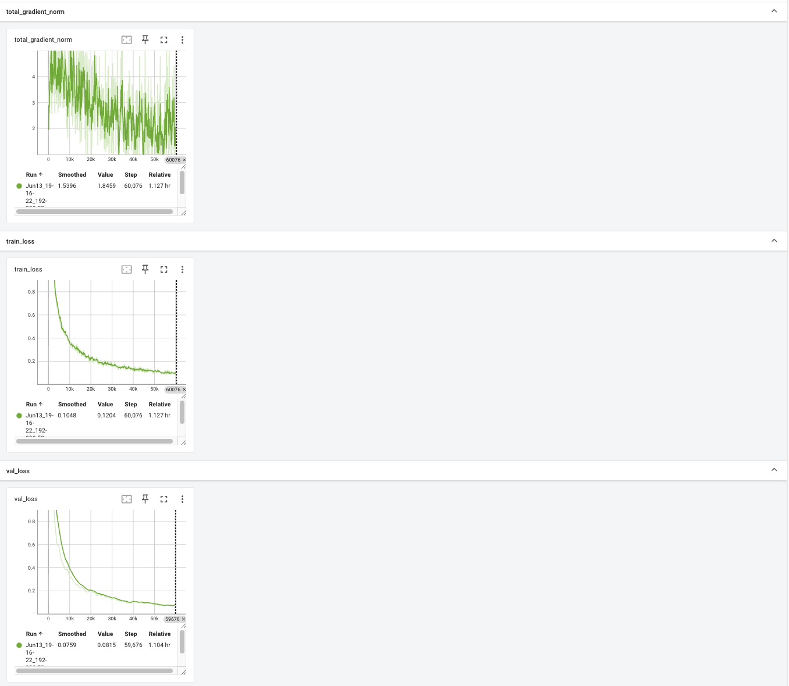

### VGG Block 0

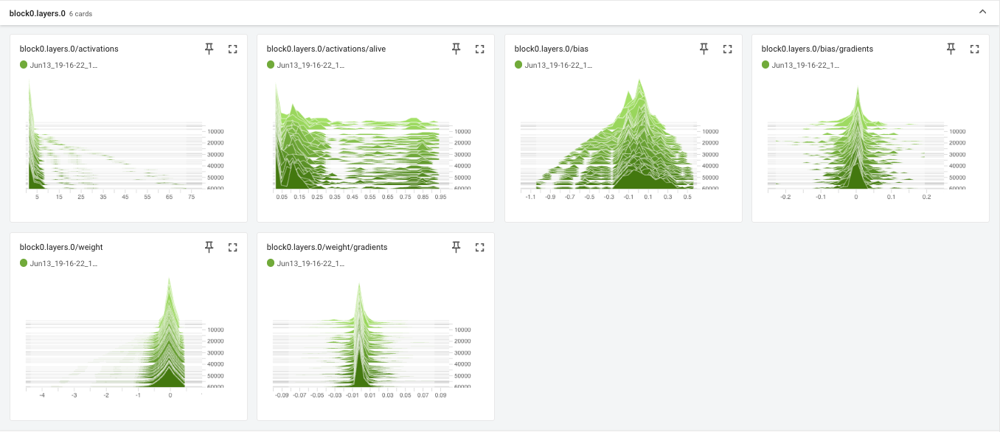
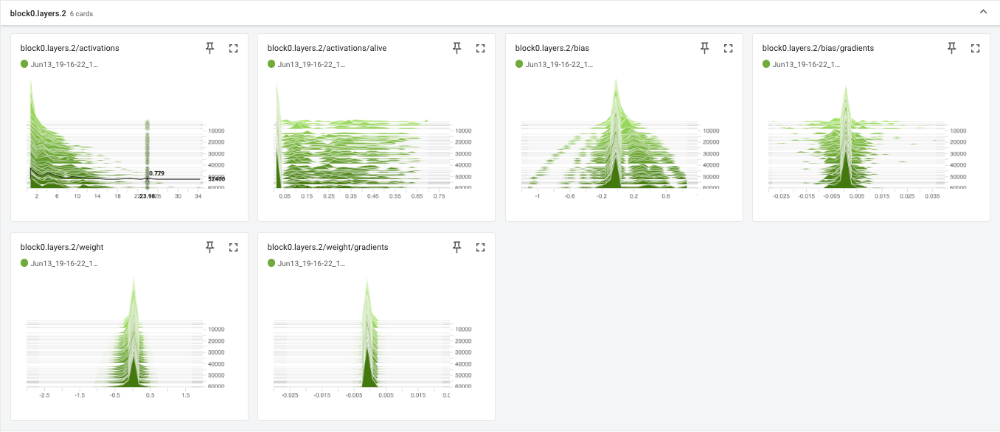
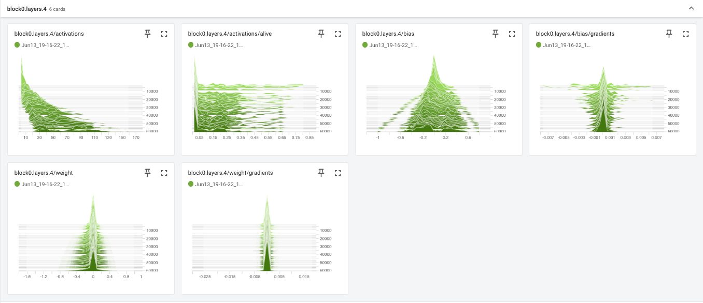

### VGG Block 1

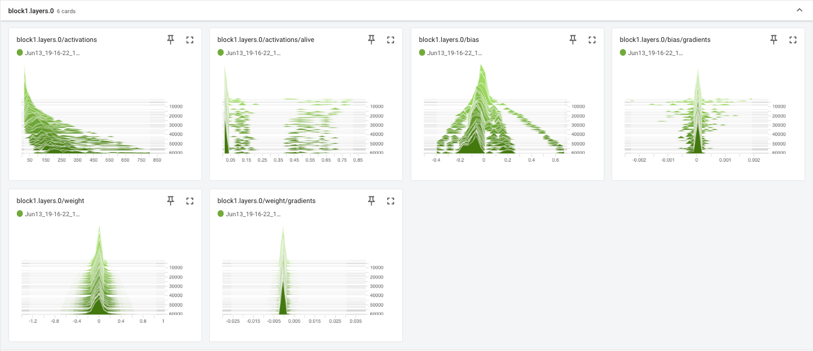
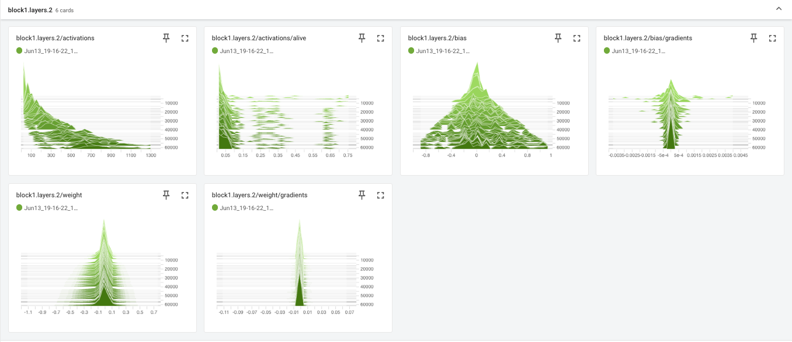
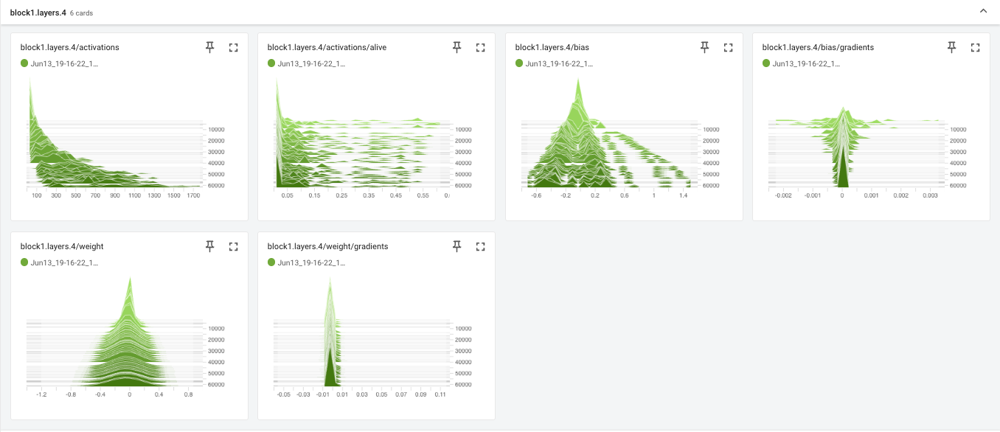

### VGG Block 2

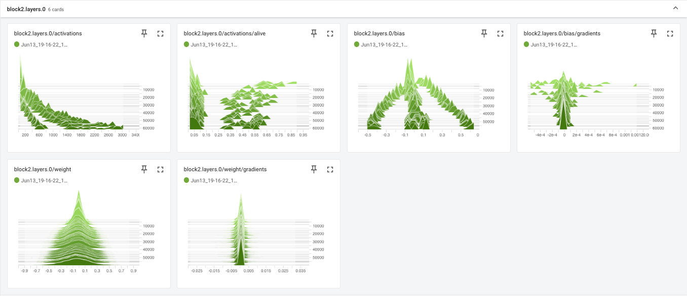
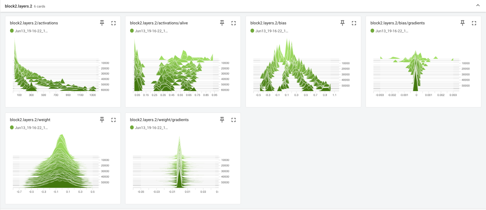
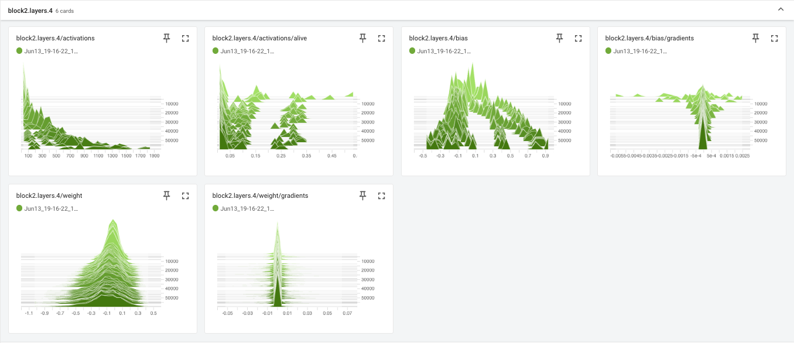

### FC Layer 1

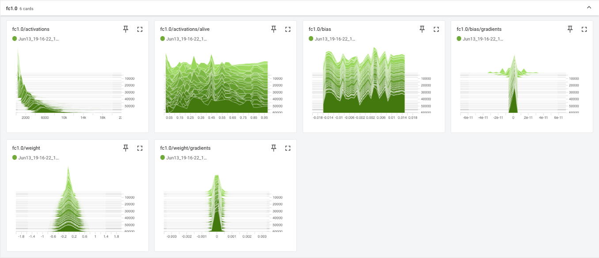

### FC Layer 2

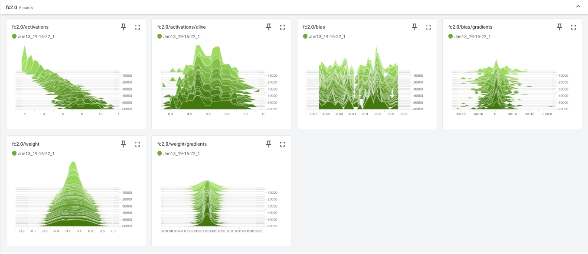

### FC Layer 3

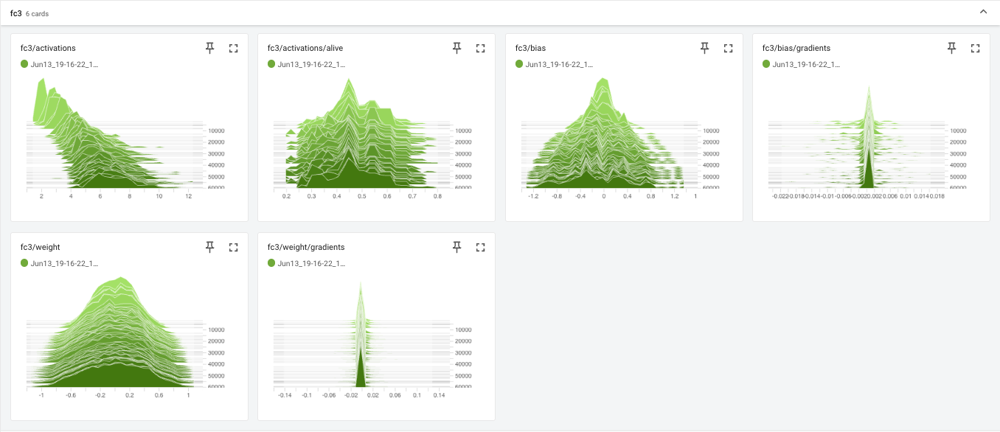
